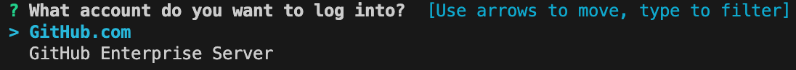
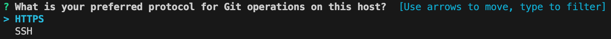
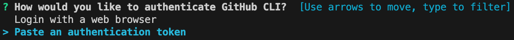
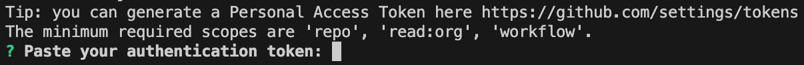
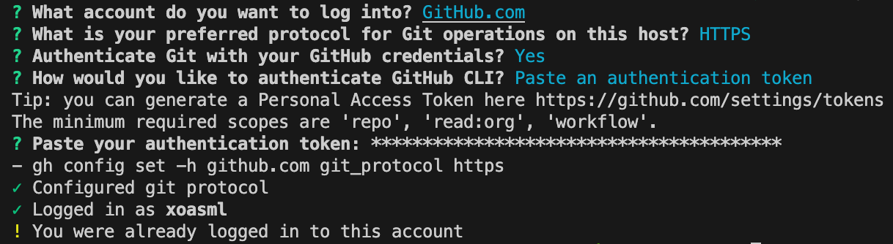

## 로컬 콘솔에서 원격 저장소 컨트롤

### Github을 컨트롤 하게 해주는 패키지
```
brew install gh
```

### Github 로그인
```
gh auth login
```
- 본인 상황에 맞게 선택


- GitHub의 인증 방법을 사용하려면 HTTPS 선택
- ssh 키를 직접 생성해서 사용하려면 ssh선택


- Github 자격 증명을 사용하여 Git을 인증 할지 여부 Y 입력


- 웹페이지 로그인을 통한 인증과 토큰을 이용한 인증 중 토큰 선택


- 토큰 입력
- 생성된 토큰이 없다면 `https://github.com/settings/tokens` 에서 생성


- 로그인 전체 과정
- 이미 로그인을 한 상태라 로그가 다를수 있음



### 레포지토리 생성
```
gh repo create <repository-name>
```

### 레포지토리 생성 예시
```
gh repo create my-new-repo --public --description "My new repository"
```
