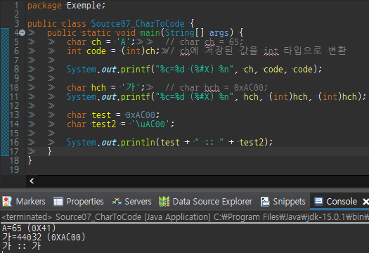
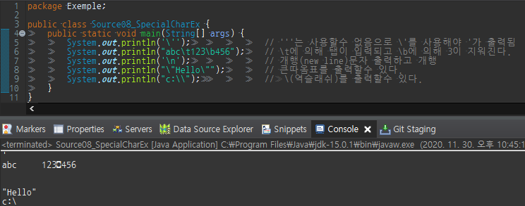

기본형의 보다 세부적인 내용에 대해 살펴보자
​
### **논리형 - boolean** 
​
논리형에는 boolean 한가지 밖에 없고 변수에는 true, false중 하나를 저장 할수 있으며 기본값(default)는 fasle이다.  
​
boolean은 대답(yes/no) 스위치(on/off) 등의 논리구현에 주로 사용된다.  
​
true/false 2가지의 값만은 표현하면 되므로 1bit로 충분하지만 자바에서는  
​
데이터를 이루는 최소단위가 byte이기 때문에 1byte이다.  
​
```
boolean power = true;
boolean checked = False; //에러. 대소문자가 구분됨. true 또는 false만 가능
```
​
### **문자형 - char**
​
문자형 역시 'char' 한가지 밖에 없고 문자를 저장하기 위한 변수이다  
​
또한 char는 한가지 문자만을 저장할 수 있다.  
​
```
char ch = 'A'; // 문자 'A'를 char타입의 변수 ch에 저장.
```
​
위의 코드에서 ch에 A가 저장되는 것 같지만 컴퓨터는 숫자밖에 모르기 때문에 문자의 유니코드(정수)가 저장된다.  
​
문자 'A'의 유니코드는 65이므로, ch에는 65가 저장된다.  
​
문자 리터럴 대신 문자의 유니코드를 직접 저장하는것도 가능하다.  
​
```
char ch = 65;   //문자의 코드를 직접 변수 ch에 저장
```
​
만일 특정 문자의 유니코드를 알고싶다면..
​
```
int code = (int)ch; // ch에 저장된 값을 int타입으로 변환하여 저장
```
​
  
​
위 코드의 실행결과를 보면 'A'의 유니코드는 65(16진수로 0x41)  
​
문자 '가'의 유니코드는 44032(16진수로 0xAC00)  
​
문자 리터럴 대신에 유니코드를 직접 사용할 수도 있다.  
​
```
char hch = 0xAC00;  //char hch = '가'
char hch = '\uAC00' // 이렇게도 가능
```
​
**특수 문자 다루기**
​
영문자 이외 tab, backspace등의 특수문자도 아래와 같이 조금 특별한 방법으로 저장이 가능하다.  
​
```
char tab = '\t'; // 변수 tab에 탭 문자를 저장
```
​
'\\t'는 실제로 두 문자로 이루어져 있지만 한 문자를 의미한다  
​
<table style="border-collapse: collapse; width: 100%;" border="1" data-ke-style="style12" data-ke-align="alignLeft">
<tbody>
<tr>
<td style="width: 50%; text-align: center;">특수 문자</td>
<td style="width: 50%; text-align: center;">문자 리터럴</td>
</tr>
<tr>
<td style="width: 50%;">tab</td>
<td style="width: 50%;">\t</td>
</tr>
<tr>
<td style="width: 50%;">backspace</td>
<td style="width: 50%;">\b</td>
</tr>
<tr>
<td style="width: 50%;">form feed</td>
<td style="width: 50%;">\f</td>
</tr>
<tr>
<td style="width: 50%;">new line</td>
<td style="width: 50%;">\n</td>
</tr>
<tr>
<td style="width: 50%;">carriage return</td>
<td style="width: 50%;">\r</td>
</tr>
<tr>
<td style="width: 50%;">역슬래쉬</td>
<td style="width: 50%;">\\</td>
</tr>
<tr>
<td style="width: 50%;">작은따옴표</td>
<td style="width: 50%;">\'</td>
</tr>
<tr>
<td style="width: 50%;">큰따옴표</td>
<td style="width: 50%;">\"</td>
</tr>
<tr>
<td style="width: 50%;">유니코드(16진수)문자</td>
<td style="width: 50%;">\u유니코드 (예: '\u0041')</td>
</tr>
</tbody>
</table>
​
  