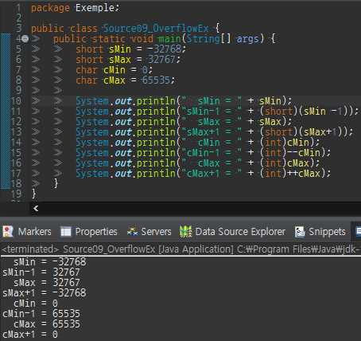

정수형에는 크게 4가지가 있으며 각 자료형이 저장할 수 있는 값의 범위가 서로 다르다.

크기순으로 나열하면 다음과 같고, 단위는 byte이다.

```
 byte     <    short    <     int     <     long 
(1byte)       (2byte)      (4byte)       (8byte)
```

byte부터 long까지 1 byte부터 시작해서 2배씩 크기가 증가한다.

이중에서도 기본 자료형(default data type)은 int이다.

| 타입 | 저장 가능한 값의 범위 | bit | byte |
| --- | --- | --- | --- |
| byte | \-128 ~ 127 | 8 | 1 |
| short | \-32,768 ~ 32,767 | 16 | 2 |
| int | \-2,147,483,648 ~ 2,147,483,647 (약 ±20억) | 32 | 4 |
| long | \-9,223,372,036,854,775,808 ~ 9,223,372,036,854,775,807 | 64 | 8 |

**정수형의 선택기준**

변수에 저장하려는 정수값의 범위에 따라 4개중 하나를 선택하면 되겠지만

byte, short보다 int를 선택하도록 하자. byte와 short는 int보다 크기가 작아서

메모리를 절약할 수는 있지만 저장하는 범위가 작아 연산시 범위를 넘어가게 되어

잘못된 결과를 얻기가 쉽다.

**결론적으로 정수형 변수를 선언할 때는 int타입을 쓰고 int의 범위(약 ±20억)를**

**넘어서는 수를 다뤄야할 때는 long을 사용하면 된다.**

**정수형의 오버플로우**



short 타입과 char 타입의 최대값과 최소값에 1을 더하거나 뺀 결과를 출력하였다.

실행결과를 좀더 이해하기 쉽게 정리하면 다음과 같다.

```
 sMin -1 → sMax	//최소값 -1 → 최대값
-32768    32767
 sMax +1 → sMin	//최대값 +1 → 최소값
 32767   -32768
 cMin -1 → cMax  //최소값 -1 → 최대값
  0       65535
 cMax +1 → cMin  //최대값 +1 → 최소값
 65535      0
```
