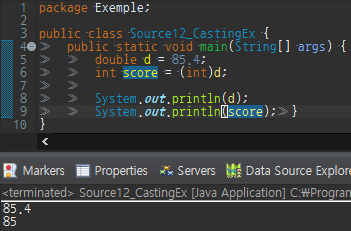
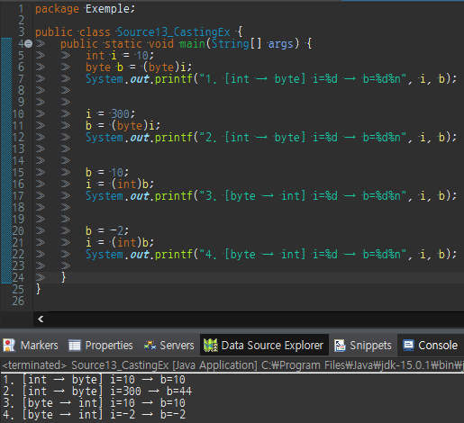
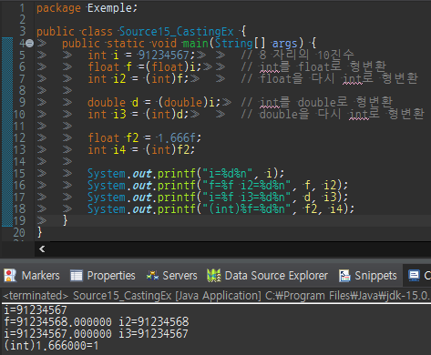

### 형변환이란?

코드를 작성하다 보면 같은 타입뿐만이 아니라 서로 다른 타입간의 연산을 수행해야 하는 경우도 있다.

이럴 때는 연산을 수행하기 전에 타입을 일치시켜야 하는데

변수나 리터럴의 타입을 다른 타입으로 변환하는 것을 **형변환(casting)**이라고 한다.

### **형변환 방법**

뭔가 거창할것 같은 이름에 비해 형변환 방법은 간단한것 같다.

그냥 형변환 하고자 하는 변수나 리터럴의 앞에 변환 하고자 하는 타입을 괄호와 함께 작성하면 끝이다.

```
duoble d = 85.4;
int score = (int)d;	// double타입의 변수 d를 int타입으로 형변환
// tip.피연산자 d의 값은 형변환 후에도 아무런 변화가 없다
```

  

기본형 타입 **boolean**, char, byte, short, int, long, float, double에서 **boolean**을 **제외**한 나머지 타입은

서로 형변환이 가능하다.

| 변환 | 수식 | 결과 |
| --- | --- | --- |
| int → char | (char)65 | 'A' |
| char → int | (int)'A' | 65 |
| flaot → int | (int)1.6f | 1 |
| int → float | (float)10 | 10.0f |

위의 표에서 3번째 행(float → int)을 보면 소수점 이하 값이 버림으로 처리된다는 것을 잘 기억해주어야겠다.

이는 double → int도 마찬가지이다.

### **정수간, 실수간 형변환**

**정수간** 큰 타입에서 작은 타입으로 변환, int(4byte)에서 byte(1byte)로 변환하는 경우 값 손실(loss of data)이

발생할 수 있다.

반대로 작은 타입에서 큰 타입으로 변환, byte(1byte)에서 int(4byte)로 변환하는 경우는

저장공간이 부족하지 않아서 값 손실이 발생하지 않는다.

  

보이는것과 같이 큰 타입에서 작은 타입으로 변환시 값 손실(loss of data)가 발생했다.

```
int i = 300;
byte b = (byte)i;	// 300을 넣었음에도 결과가 44가 나왔다.
```

**실수간** 형변환에서도 정수처럼 작은 타입에서 큰 타입으로 변환하는 경우 즉 float타입의 범위를 넘는 값을

float으로 형변환 하는 경우 "±무한대" 또는 "±0"을 결과로 얻는다.

```
double d = 1.0e100; 	//float의 최대값보다 큰 값을 d에 저장( 1.0x10(100승) )
float  f = (float)d;	//d의 값을 float으로 형변환해서 f에 저장. f는 무한대가 된다.

double d = 1.0e-50; 	// float의 최소값보다 작은 값을 d에 저장( 1.0x10(-50승) )
float f = (float)d; 	// f의 값은 0이 된다.
```

### **정수형과 실수형 간의 형변환**

먼저 **정수에서 실수로 변환**하는것에 대한 내용을 살펴보자

실수형은 정수형보다 훨씬 큰 저장범위를 갖기 때문에, 정수형을 실수형으로 변환하는 것은 큰 무리가 없다.

하지만 실수형의 정밀도의 제한으로 **(float : 7자리, double : 15자리)** 20억으로 10자리수의 정밀도를 가진

int를 float으로 변환시 정밀도 차이로 인해 오차가 발생할수 있다

**정수인 int를 실수형으로 변환할때는 float이 아닌 double로 형변환**해야 오차가 발생하지 않는다.

**실수를 정수형으로 변환** 할때의 값의 변화에는 실수에서 저장되어있는

**소수점이하의 값은 반올림 되지 않고 버려진다**는 것이다.

또한 실수의 소수점이하의 값을 버리고 남은 정수가 정수형의 저장범위를 넘는 경우에 정수의 오버플로우가

발생할수 있다.

```
//double의 정밀도 15, int의 자리수 10자리
double d = 1234567890123.45
int i = (int)d;	// d에 담긴 숫자의 소수점을 제거 해도 13자리이므로 문제가 발생 
```

  

### 자동 형변환

서로 다른 타입간의 대입, 연산을 할 때, 형변환을 통한 타입의 일치는 필수이다

하지만 경우에 따라 편의상의 이유로 형변환을 생략할 수 있다.

이때 정말로 형변환이 이루어지지 않는 것은 아니고 컴파일러가 형변환을 자동으로 해주게 된다.

```
float f= 1234; // 형변환 생략 float f = (float)1234; 와 같다.

int i = 3;
double d = 1.0 + i; // 형변환 생략 double d = 1.0 + (double)i; 와 같다
```

연산과정에서 자동적으로 발생하는 형변환을 **"산술 변환"**이라고 한다.

자동 형변환이라도 무적은 아니다 컴파일러가 자동으로 형변환을 해주는 규칙이 있는데 아래와 같고

```
byte(1byte) → short(2byte) → int(4byte) → long(8byte) → float(4byte) → double(8byte)
               char(2byte) ↗
```

만약 화살표의 역방향으로 형변환을 해야 한다면 꼭 형변환 연산자를 써줘야 한다.
