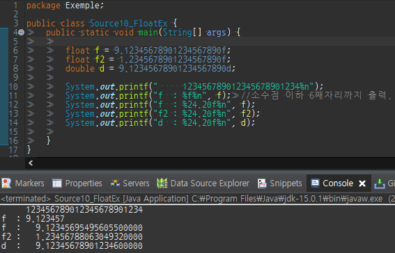

실수형은 실수를 저장하기 위한 타입으로 float와 double 두 가지가 있으며 각 타입의 변수에  
​
저장할 수 있는 값의 범위는 아래와 같다.
​
<table style="border-collapse: collapse; width: 100%; height: 40px;" border="1" data-ke-style="style12" data-ke-align="alignLeft">
<tbody>
<tr style="height: 20px;">
<td style="width: 15%; height: 20px; text-align: center;">타입</td>
<td style="width: 49.3024%; height: 20px; text-align: center;">저장 가능한 값의 범위(양수)</td>
<td style="width: 10.6976%; height: 20px; text-align: center;">정밀도</td>
<td style="width: 12.5%; height: 20px; text-align: center;">bit</td>
<td style="width: 12.5%; text-align: center;">byte</td>
</tr>
<tr style="height: 20px;">
<td style="width: 15%; height: 20px; text-align: center;" rowspan="2">float</td>
<td style="width: 49.3024%; height: 20px; text-align: center;">1.4 x 10(-45승) ~ 3.4 x 10(38승)</td>
<td style="width: 10.6976%; height: 20px; text-align: center;" rowspan="2">7자리</td>
<td style="width: 12.5%; height: 20px; text-align: center;" rowspan="2">32</td>
<td style="width: 12.5%; text-align: center;" rowspan="2">4</td>
</tr>
<tr>
<td style="width: 49.3024%; text-align: center;"><span style="color: #333333;">-1.4 x 10(-45승) ~ -3.4 x 10(38승)</span></td>
</tr>
<tr>
<td style="width: 15%; text-align: center;" rowspan="2">double</td>
<td style="width: 49.3024%; text-align: center;"><span style="color: #333333;">4.9 x 10(-324승) ~ 1.8 x 10(308승)</span></td>
<td style="width: 10.6976%; text-align: center;" rowspan="2">15자리</td>
<td style="width: 12.5%; text-align: center;" rowspan="2">64</td>
<td style="width: 12.5%; text-align: center;" rowspan="2">8</td>
</tr>
<tr>
<td style="width: 49.3024%; text-align: center;">-4.9 x 10(-324승) ~ -1.8 x 10(308승)</td>
</tr>
</tbody>
</table>
​
**실수형의 선택 기준**
​
만일 7자리 이상의 정밀도가 필요하다면, 변수의 타입을 double로 해야한다.  
​
double타입은 float 타입보다 정밀도가 약 2배인, 10진수로 15자리의 정밀도를 가진다.  
​
즉  연산속도의 향상이나 메모리를 절약하려면 float를 선택하고  
​
더 큰 값의 범위라던가 더 높은 정밀도를 필요로 한다면 double을 선택해야 한다.  
​
  
​
실수형 값을 출력할 때는 printf메서드의 지시자 '%f'를 사용한다  
​
'%f'는 기본적으로 소수점 6자리까지만 출력하므로 7번째 자리에서 반올림 되어  
​
'9.123457'이 되었다  
​
```
System.out.printf("f  : %f\n", f);      // f : 9.123457
```
​
%24.20f는 전체 24자리중에 20자리는 소수점 이하의 수를 출력하라는 뜻이다.  
​
```
System.out.printf("f : %24.20f\n", f);
```
​
예제의 코드의 변수 f에 저장하려던 값은  
​
**9.123456**78901234567890  
​
저장된 값은  
​
**9.123456**95495605500000  
  
​
float타입의 변수 f에 저장하려던 값은 **9.123456**78901234567890 이지만 저장공간의 한계로  
​
오차가 발생하여 실제 저장된 값은 **9.123456**95495605500000이다.  
​
float의 정밀도가 7자리 이므로 원래의 값에 7자리의 값만 오차없이 저장된 것이다.  