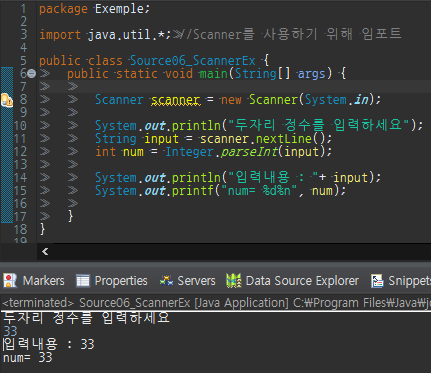

지금까지와는 다르게 화면에 출력만 하는것이 아닌 입력도 받아보려 한다
​
이를 위해 Scanner클래스를 이용하여 화면으로부터 입력 받는 방법을 알아보자.
​
Scanner 클래스를 사용하려면 아래와 같이 **import**를 해줘야한다.
​
```
import java.util.*; // Scanner 클래스를 사용하기 위해 추가
```
​
그 다음 Scanner클래스의 객체를 생성.
​
```
Scanner scanner = new Scanner(System.in); // Scanner클래스의 객체를 생성
```
​
nextLine()이라는 메서드를 호출하면, 입력대기 상태가 되는데 원하는 입력을 마치고
​
"엔터키(Enter)"를 누르면 내용이 문자열로 반환된다.
​
```
String input = scanner.nextLine(); //입력받은 내용을 input에 저장
int num = Integer.parseInt(input); //입력받은 내용을 input타입의 값으로 변환
```
​
만일 입력받은 문자열을 숫자로 변환하려면, Integer.parseInt()라는 메서드를 사용해야 한다.
​
 - Scanner클래스에는 nextLine()나 nextFloat()와 같은 변환없이 숫자로 바로 입력받는 메서드가 있음.  
   그러나 이 메서드들은 화면에서 연속적으로 값을 입력받아 사용하기 까다로우니 차라리  
  nextLine()으로 입력받아 적절히 변환하는 것이 더 낫다.  
​


​

위의 예제에서 만일 숫자가 아닌 문자, 기호를 입력 시  
문자열을 숫자로 변환하는 과정인 Integer.parseInt()에서 에러가 난다.