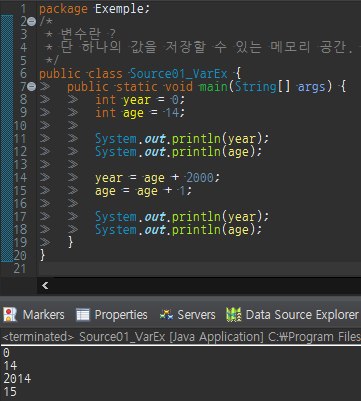
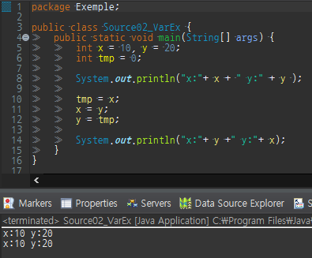

변수란, 단 하나의 값을 저장할 수 있는 메모리 공간
​
단 하나의 값만 저장할 수 있으므로 새로운 값을 저장하면 기존의 값은 사라진다.
​
변수를 사용하려면 먼저 변수를 선언해야 한다.
​
```
int age; // age라는 이름의 변수를 선언
```
​
변수를 선언한 이후 변수를 사용할 수 있으나 그전에 반드시 초기화해야 한다.
​
```
int age = 25; // 변수 age를 선언하고 25로 초기화한다.
```
​
아래의 양쪽 코드는 서로 같은 의미의 다른 코드이다.
​
변수는 한 줄에 하나씩 선언하는 것이 보통이지만, 타입이 같은 경우 콤마로 여러 변수를 한 줄에 
​
선언하기도 한다.
​
```
int a;          
int b;                  int a, b;
int x = 0;              int x = 0, y = 0;
int y = 0;      
```
​
- 변수의 초기화란 변수를 사용하기 전에 처음으로 값을 저장하는 것

​

- 두 변수의 값을 교환하기  


​

<table style="border-collapse: collapse; width: 100%;" border="1" data-ke-style="style12" data-ke-align="alignLeft">
  <tbody>
    <tr>
      <td style="width: 20%;">&nbsp;</td>
      <td style="width: 20%;">1 byte</td>
      <td style="width: 20%;">2 byte</td>
      <td style="width: 20%;">4 byte</td>
      <td style="width: 20%;">8 byte</td>
    </tr>
    <tr>
      <td style="width: 20%;">논리형</td>
      <td style="width: 20%;">boolean</td>
      <td style="width: 20%;">&nbsp;</td>
      <td style="width: 20%;">&nbsp;</td>
      <td style="width: 20%;">&nbsp;</td>
    </tr>
    <tr>
      <td style="width: 20%;">문자형</td>
      <td style="width: 20%;">&nbsp;</td>
      <td style="width: 20%;">char</td>
      <td style="width: 20%;">&nbsp;</td>
      <td style="width: 20%;">&nbsp;</td>
    </tr>
    <tr>
      <td style="width: 20%;">정수형</td>
      <td style="width: 20%;">byte</td>
      <td style="width: 20%;">short</td>
      <td style="width: 20%;"><b>int</b></td>
      <td style="width: 20%;">long</td>
    </tr>
    <tr>
      <td style="width: 20%;">실수형</td>
      <td style="width: 20%;">&nbsp;</td>
      <td style="width: 20%;">&nbsp;</td>
      <td style="width: 20%;">float</td>
      <td style="width: 20%;"><b>double</b></td>
    </tr>
  </tbody>
</table>
​

-   주로 int가 사용, byte는 이진 데이터, short는 C언어와의 호환을 위해 사용

- 실수형 : float, **double**
- 주로 double을 사용함​
- boolean은 true와 false 두 가지 값만 표현할 수 있으면 되므로 가장 작은 크기인 1byte  
- char은 자바에서 유니코드(2btye 문자 체계)를 사용하므로 2byte.​  
- byte는 크기가 1byte라서 byte.  
- int(4byte)를 기준으로 짧아서 short(2byte) 길어서 long(8byte). (short ↔ long).  
- float는 실수값을 부동소수점(floating-point) 방식으로 저장하기 때문에 float.  
- double은 float보다 두 배의 크기(8byte)를 갖기 때문에 double.  
​
#### 변수의 명명규칙
1. 대소문자가 구분되며 길이에 제한이 없다.
   - True와 true는 서로 다른 것으로 간주
​
2. 예약어를 사용해서는 안된다.
   - true는 예약어라서 사용할 수 없지만 True는 사용 가능
​
3. 숫자로 시작해서는 안된다.
   - top10은 허용하지만, 7up은 허용되지 않음
​
4. 특수문자는 \_ 와 $만을 허용한다.
   - $harp은 허용, S#arp는 허용 안 됨
**자바 프로그래머들에게 권장되는 규칙**
​
5. 클래스 이름의 첫 글자는 항상 대문자
   - 변수와 메서드 이름의 첫 글자는 항상 소문자로 한다.
​
6. 여러 단어로 이루어진 이름은 단어의 첫 글자를 대문자로 한다.
   - lastindexOf, StringBuffer
​
7. 상수의 이름은 모두 대문자로 한다. 여러 단어로 이루어진 경우 \_ 로 구분한다
   - PI, MAX\_NUMBER
​
