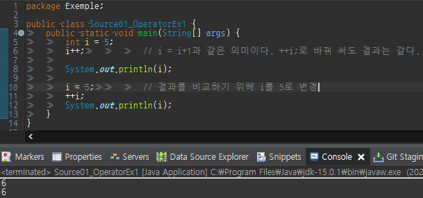
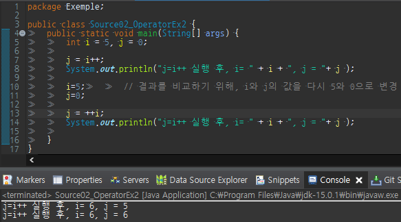
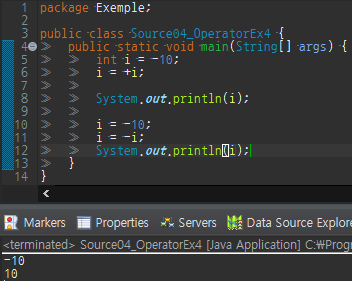

### 증감 연산자 ++ --
​
증감연산자는 피연산자에 저장된 값을 1증가 시키거나 감소시킨다.  
​
증감연산자는 정수와 실수에 모두 사용 가능하지만 상수는 값을 변경할 수 없으므로 가능하지 않다.  
​
```
증가 연산자(++) 피연산자의 값을 1 증가시킨다.
감소 연산자(--) 피연산자의 값을 1 감소시킨다.
```
​
일반적으로 단항 연산자는 피연산자의 왼쪽에 위치하지만  
​
++ 증가 연산자와 -- 감소 연산자 모두 왼쪽, 오른쪽 모두다 위치가 가능하다  
​
피연산자의 왼쪽에 위치하면 "전위형(prefix)", 오른쪽에 위치하면 "후위형(postfix)"라고 한다.  
​
전위형과 후위형 모두 피연산자의 값을 1 증가, 감소 시키지만  
​
수식이나 메서드 호출에 포함된 경우 전위형과 후위형의 결과가 다르다.  
​
<table style="border-collapse: collapse; width: 100%; height: 57px;" border="1" data-ke-style="style12" data-ke-align="alignLeft">
<tbody>
<tr style="height: 20px;">
<td style="width: 33.3333%; text-align: center; height: 20px;">타입</td>
<td style="width: 33.3333%; text-align: center; height: 20px;">설명</td>
<td style="width: 33.3333%; text-align: center; height: 20px;">사용예</td>
</tr>
<tr style="height: 20px;">
<td style="width: 33.3333%; text-align: center; height: 20px;">전위형</td>
<td style="width: 33.3333%; height: 20px; text-align: left;">&nbsp;값이 참조되기 전에 증가시킨다.</td>
<td style="width: 33.3333%; text-align: center; height: 20px;">j = ++i;</td>
</tr>
<tr style="height: 17px;">
<td style="width: 33.3333%; text-align: center; height: 17px;">후위형</td>
<td style="width: 33.3333%; height: 17px; text-align: left;">&nbsp;값이 참조된 후에 증가시킨다.</td>
<td style="width: 33.3333%; text-align: center; height: 17px;">j = i++;</td>
</tr>
</tbody>
</table>
​
하지만 ++i와 i++ 처럼 증감연산자가 수식, 메서드 호출에 포함된게 아닌 독립적인 하나의 문장으로 쓰인 경우  
​
전위형과 후위형의 차이는 없다.
​
```
++i;    // i의 값을 1 증가시킨다.
i++;    // 위의 문장과 차이가 없다.
```
​
  
​
위 예제의 경우 증가 연산자가 전위형, 후위형에 따라 다르지 않은 결과를 보여주고 있다  
​
이유는 수식이나 메서드에서 사용된게 아니기 때문이다.  
​
  
​
실행결과를 보면 i의 값은 두 경우 모두 1이 증가되어 6이지만 j의 값은 그렇지 않다.  
​
이유는 전위형은 변수(피연산자)의 값을 먼저 증가시킨 후에 대입연산자가 실행되는 반면  
​
후위형은 대입연산자가 먼저 실행된 후에 변수(피연산자)의 값을 증가 시킨다.  
​
증감 연산자가 포함된 식을 이해하기 어려울 때는 다음과 같이 증감 연산자를 따로 떼어내면  
​
이해가 쉬워진다. 전위형의 경우 증감연산자를 식의 이전으로,  
​
```
j = ++i; // 전위형 
    ↓
++i;    // 증가하여
j = i;  // 참조하여 대입
```
​
후위형의 경우 증감연산자를 식의 이후로 떼어내면 이해가 쉽다.  
​
```
j = i++; // 후위형 
    ↓
j = i;  //참조하여 대입 후에
i++;    // 증가
```
​
증감연산자는 사용하면 코드가 간결해지지만 지나치면 코드가 복잡해서 이해하기 힘들어진다.  
​
```
int x = 5;
x = x++ - ++x;
```
​
위와 같은 코드는 바람직하지 않다. 하나의 식에서 증감연산자의 사용을 최소화하고  
​
**식에 두 번 이상 포함된 변수에 증감연산자를 사용하는 것은 피해야 한다.**  
​
### **부호 연산자 + -**
​
부호 연산자 - 는 피연산자의 부호를 반대로 변경하는 결과를 반환해준다.  
​
피연산자가 **양수 → 음수, 음수 → 양수** 부호 연산자 +는 하는 일이 없으며  
​
쓰이는 경우도 거의 없다. 부호연산자 -가 있으니 형식적으로 +를 추가해 놓은 것뿐이다.  
​
부호 연산자는 boolean, char를 제외한 기본형에만 사용할 수 있다.  
​
  