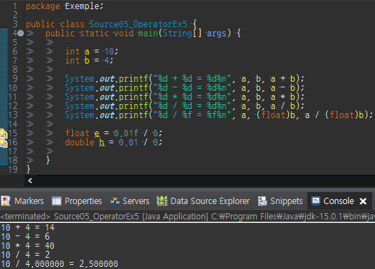
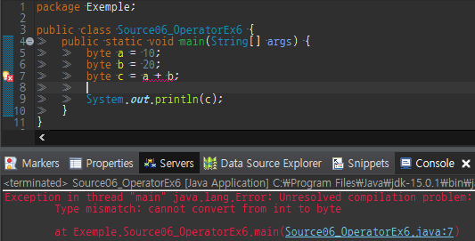
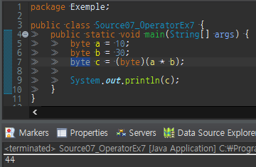
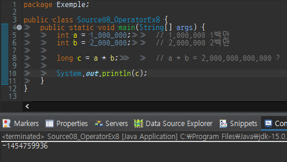
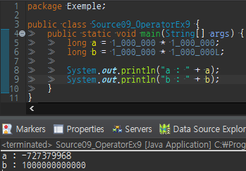

산술 연산자에는 사칙 연산자(+, -, \*, /)와 나머지 연산자 (%)가 있다.

사칙연산은 일상생활에서도 자주 쓰기 때문에 큰 어려움이 없지만 

몇 가지 주의 사항이 있어 그것들을 짚고 넘어가자.

### 사칙 연산자 + - \* /

사칙 연산자, 덧셈(+), 뺄셈(-), 곱셈(\*), 나눗셈(/)은 아마 프로그래밍에서 가장 많이

사용되는 연산자들 일 것이다.

이미 알고 있는 상식처럼 프로그래밍에서도 곱셈(\*) 나눗셈(/) 나머지(%) 연산자가

덧셈(+) 뺄셈(-) 연산자보다 우선순위가 높고 만약 정수인 피연산자를 0으로 나누게 되면

예외가 발생하게 되며 실수를 0으로 나누게 되면 결과로 무한대(Infinity)가 나온다.

```
float e = 0.01f / 0; 	//	결과 : Infinity
double h = 0.01 / 0; 	//  결과 : Infinity

int x = 10 / 0;	// Exception in thread "main" java.lang.ArithmeticException: / by zero
```



두 변수 a와 b에 각각 10, 4를 저장하여 사칙연산을 수행하고 그 결과를 확인하는 예제이다.

코드 12행을 주목하면 10/4를 했는데 결과가 2.5가 아닌 2라는 것이다.

나누기 연산자의 두 피연산자가 모두 int타입인 경우 연산결과 역시 int로 소수점은 버려지고

2.5일지라도 반올림은 발생하지 않는다.

그래서 올바른 연산결과를 얻기 위해 두 피연산자중 한 쪽은 실수형으로 형변환 해야한다.

  

위의 예제를 보면 컴파일 에러가 발생하는데 이유는 변수 a와 b 모두 byte형이기 때문에

연산자 '+'가 이 두개의 피연산자 a, b를 int로 형변환 하게 되고 덧셈까지는 되지만 

다시 byte형 변수 c에 대입연산이 이루어질때 int(4byte)에서 byte(1byte)로 대입 하려고 해서

생긴 컴파일 에러 이다 이때는 아래와 같이 명시해주어야 예외가 발생하지 않는다.

```
byte c = (int)(a + b);
```

  

10 \* 30이라면 당연히 300이 결과여야 하지만 위의 예제에서는 44의 결과가 나왔다..? 읭?

이유는 이미 알고 있었다 byte가 300이라는 숫자를 다 소화하지 못해서 인데

이로인해 데이터의 손실이 일어나게 된 것이다. 이러한 데이터의 손실을 막기 위해서는

충분히 큰 자료형을 선택해야 한다.



식 a \* b의 결과 값을 담을 변수 c가 long(8byte)타입 이기 때문에 "2,000,000,000,000"을 담기에 충분해 보이지만

결과는 -1454759936이 나왔다.

그 이유는 int타입과 int타입의 연산결과는 int타입이기 때문에 이미 오버플로우가 발생했기 때문에 대입연산시

자동으로 long타입으로 형변환 된다고 해도 이미 int타입에 담겨 있는 \-1454759936가 형변환되어

long 타입의 변수 c에 담기기 때문이다.

올바른 결과를 원한다면 아래의 코드 처럼 작성해야한다.

```
long c = (long)a * b; 
```



위의 예제도 앞서 살펴본 예제와 비슷 한 경우이다 

변수 long a 에 1,000,000 \* 1,000,000 를 연산하여 대입 했는데 기대한 값이 아닌 데이터 손실이 생겼다.

이 이유는 1\_000\_000 \* 1\_000\_000 과정이 int \* int 이기 때문이 결과는 int, 이미 오버플로우가 발생했고

오버플로우된 데이터가 long a에 대입되었기 때문이다.

반대로 변수 long b에 담긴 데이터는 기대한 데이터가 나왔는데 이것은

계산식 1\_000\_000 \* 1\_000\_000L 롱을 명시해주어 int \* long이 되었기 때문에

int가 long으로 형변환되어 연산이 이루어져 long \* long 으로 결과가 long, 저장 공간이 충분했기 때문에

올바른 결과를 얻을수 있었다.

아래와 같이 수식의 순서에 따라서도 결과가 다를수 있다.

```
int a = 1000000;
		
int result1 = a * a / a;	// 1000000 * 1000000 / 1000000
int result2 = a / a * a;	// 1000000 * 1000000 / 1000000
        
/*
result1 = -727
result2 = 1000000
*/
```
