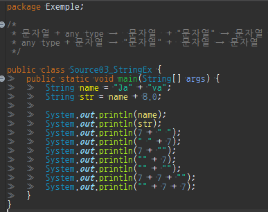

상수는 변수와 마찬가지로 값을 저장할 수 있는 공간이지만

변수와 달리 한번 값을 저장하면 다른 값으로 변경할 수 없다.

리터럴이란 변수를 초기화 할 때 쓰이는 데이터

```
int year = 2020  // year이 변수, 2020이 리터럴
final YEAR = 2020 // YEAR이 상수, 2020이 리터럴
```

상수를 선언하는 방법은 '**final**'을 붙여주기만 하면 된다

```
final int MAX_LV = 99;    // 상수 MAX_LV 선언 & 초기화
```

상수는 반드시 선언과 동시에 초기화해야 하며, 선언 후에는 값을 변경할수 없다.

```
final int MAX_LV;        // 에러. 상수는 선언과 동시에 초기화 해야함
final int MINI_LV = 1;    // OK. 선언과 동시에 초기화 했음
MINI_LV = 100;            // 에러. 상수의 값은 변경 불가
```

'A'와 같이 작은따옴표로 문자 하나를 감싼 것을 '문자 리터럴'

"AA"와 같이 큰 따옴표로 문자들을 감싼 것을 '문자열 리터럴'

이라고 한다.

```
char ch = 'J'        // char ch = 'Java' 이렇게 할 수 없다.
String name = "Java"    // 변수 name에 문자열 리터럴 "Java"를 저장
```

문자열 이지만 덧셈 연산자를 이용하여 문자열을 결합할 수 있다

```
String name = "Ja" + "va"    //결과는 "Java"
String str = name + 8.0     //str은 "Java8.0"
```

덧셈 연산자는(+) 피연산자가 모두 숫자일 때는 두 수를 더하지만

피연산자중 한쪽이라도 String이라면 한 쪽을 먼저 String으로 변환한 다음

두 String을 결합한다.

```
문자열 + any type →  문자열  + "문자열" → 문자열   
any type + 문자열 → "문자열" +  문자열  → 문자열
```




