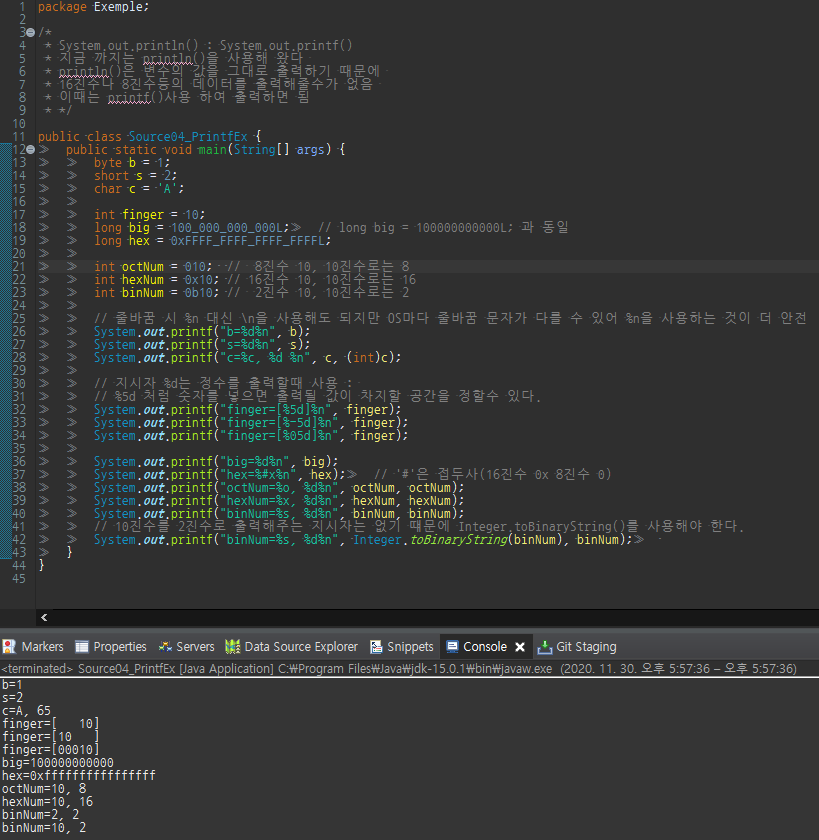
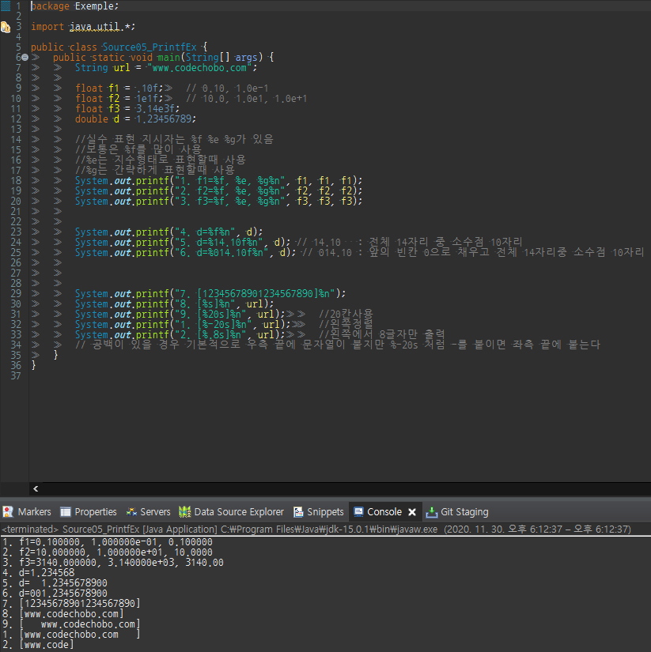

지금까지 출력을 할 때 `println()`을 주로 써왔는데

`println()`은 출력을 하기에는 편하지만 변수의 값을 그대로 출력 하기 때문에

값을 변환하지 않고는 다른 형식으로 출력할 수 없다.

**같은 값이라도 다른형식으로 출력**해야 하는 일이 생길수 있는데

예를 들면 소수점 둘째자리까지만 출력 한다던가

정수를 16진수 8진수로 출력 해야 하는 일이 생길때 `printf()`를 

사용하면 된다.

만일 출력하려는 값이 2개라면, 지시자도 2개를 사용해야한다.

```
System.out.printf("age:%d year:%d", age, year);
//첫번째 %d에 age, 두번째 %d에 year가 각각 들어가게 된다.
```

주의할 점은 `println()`과 달리 `printf()`는 자동 줄갱신을 해주지 않아서

줄바꿈을 하려면 지시자 %n을 따로 넣어줘야 한다

```
System.out.printf("age:%d", age);	//출력 후 줄바꿈X
System.out.printf("age:%d%n", age);	//출력 후 줄바꿈O
```

**자주 사용되는 printf()의 지시자**

| 지시자 | 설명 |
| --- | --- |
| %b | 불리언(**b**oolean) 형식으로 출력 |
| %d | 10진(**d**ecimal) 정수의 형식으로 출력 |
| %o | 8진(**o**ctal) 정수의 형식으로 출력 |
| %x | 16진(he**x**a-decimal) 정수의 형식으로 출력 |
| %f | 부동 소수점(**f**loating-point)의 형식으로 출력 |
| %e, %E | 지수(**e**xponent) 표현식의 형식으로 출력 |
| %c | 문자(**c**haracter)로 출력 |
| %s | 문자열(**s**tring)로 출력 |

#### 정수값에 대한 예제



정수를 출력할 때는 지시자 '%d'를 사용하는데, 출력될 값이 차지할 공간을 숫자로 지정할 수 있다.

```
System.out.printf("finger = [%5d]%n");	// finger = [   10]
System.out.printf("finger = [%-5d]%n");	// finger = [10   ]
System.out.printf("finger = [%05d]%n");	// finger = [00010]
```

지시자 '%x'와 '%o'에  #를 사용하면 접두사 '0x'와 '0'이 각각 붙는다.

```
System.out.printf("hex=%x%n");	// hex = ffffffffffffffff
System.out.printf("hex=%#x%n");	// hex = 0xffffffffffffffff
System.out.printf("hex=%#X%n");	// hex = 0XFFFFFFFFFFFFFFFF
```

8진수, 16진수와 다르게 2진수는 10진수를 2진수로 출력해주는 지시자가 없기 때문에

Integer.toBinaryString(int i)를 꼭 사용해야 한다.

```
System.out.printf("binNum=%s%n", Integer.toBinaryString(binNum);
```

실수, 문자열에 대한 예제

실수형 값의 출력에 사용되는 지시자는 %f, %e, %g가 있는데

%f가 주로 쓰이는 지시자이고

%e는 지수형태로 출력할때 사용

%g는 간략하게 표현할때 사용된다.



%f는 기본적으로 소수점 6자리 까지만 출력하기 때문에 소수점 7자리에서 반올림 한다

아래 코드와같이 소수점 6자리가 아닌 원하는 만큼의 자리수를 지정해줄수 있고

정수와 마찬가지로 전체자리를 지정해줄수 있다.

```
//%전체자리.소수점아래자리f
System.out.printf("d=%14.10f%n", d);	// 전체 14자리 중 소수점 아래 10자리
```

문자열 지시자 %s에도 숫자를 추가하면 원하는 만큼의 공간을 확보 하거나 문자열의 일부만 출력할 수 있다.

```
System.out.printf("[%s]%n", url);		//문자열의 길이만큼 출력공간을 확보
System.out.printf("[%20s]%n", url);		//20칸사용
System.out.printf("[%-20s]%n", url);		//왼쪽정렬
System.out.printf("[%.8s]%n", url);		//왼쪽에서 8글자만 출력
```
