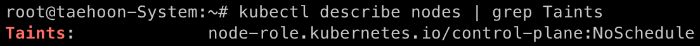
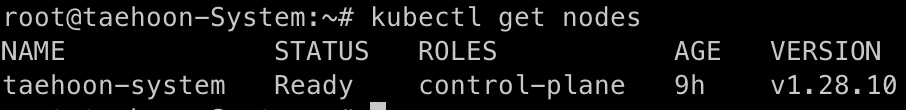

- kubeadm은 큐브애드엠 또는 큐브애덤으로 발음
### 1. Containerd 구성
- 과거 docker를 컨테이너 런타임으로 사용 했지만 1.24 버전 이후로  
  k8s는 docker를 컨테이너 런타임으로 지원하지 않는다
  containerd를 사용해야 하는 이유이다.
  
1. 네트워크 옵션 추가
```bash
cat <<EOF | sudo tee /etc/modules-load.d/containerd.conf
overlay
br_netfilter
EOF
```
```bash
sudo modprobe overlay
```
``` bash
sudo modprobe br_netfilter
```
```bash
cat <<EOF | sudo tee /etc/sysctl.d/99-kubernetes-cri.conf
net.bridge.bridge-nf-call-iptables  = 1
net.ipv4.ip_forward                 = 1
net.bridge.bridge-nf-call-ip6tables = 1
EOF
```
```bash
sudo sysctl --system
```

2. Containerd 설치
```bash
sudo apt-get update
```
```bash
sudo apt-get install \
    apt-transport-https \
    ca-certificates \
    curl \
    gnupg \
    lsb-release -y
```
```bash
curl -fsSL https://download.docker.com/linux/ubuntu/gpg | sudo gpg --dearmor -o /usr/share/keyrings/docker-archive-keyring.gpg
```
```bash
echo \
"deb [arch=arm64 signed-by=/usr/share/keyrings/docker-archive-keyring.gpg] https://download.docker.com/linux/ubuntu \
$(lsb_release -cs) stable" | sudo tee /etc/apt/sources.list.d/docker.list > /dev/null
```
```bash
sudo apt-get update
```
```bash
sudo apt-get install containerd.io -y
```
```bash
sudo mkdir -p /etc/containerd
```
```bash
containerd config default | sudo tee /etc/containerd/config.toml
```
```bash
sudo systemctl restart containerd
```

3. Cgroup 드라이버 변경
- 1.22버전 부터는 Cgroup드라이버를 systemd를 사용한다.
  containerd도 Cgroup 드라이버의 default를 systemd로 변경 해야한다.
  `/etc/containerd/config.toml`  `SystemdCGroup`을 `true`로 수정
```bash
vi /etc/containerd/config.toml
```


### 2. Kubernetes 패키지 설치
1. 스왑을 비활성화
 - 스왑메모리는 메모리가 부족할때 하드 디스크의 일부를 메모리 처럼 사용 하는 기술
 - 최대 5개의 프로세스가 실행 가능한 환경에서 6개의 프로세스를 올려야 하는 경우
   앞서 실행된 프로세스 중 일부를 Swap Patition으로 이동`swap out` 시켜 유지
   이후 다시 프로세스가 줄어들면 메모리 영역으로 이동 `swap in` 시킨다.
```bash
swapoff -a sudo sed -i '/swap/s/^/#/' /etc/fstab
```
- kubelet은 swap에 대한 상황을 처리하도록 개발되지 않았기 때문에 꺼야 문제가 안생김

2. apt 패키지 색인을 업데이트하고, 쿠버네티스 apt 리포지터리를 사용하는 데 필요한 패키지를 설치한다.
```bash
sudo apt-get update
sudo apt-get install -y apt-transport-https ca-certificates curl
```

3. 구글 클라우드의 공개 사이닝 키를 다운로드 한다.

```bash
curl -fsSL https://packages.cloud.google.com/apt/doc/apt-key.gpg | sudo gpg --dearmor -o /etc/apt/keyrings/kubernetes-archive-keyring.gpg

curl -fsSL https://pkgs.k8s.io/core:/stable:/v1.28/deb/Release.key | sudo gpg --dearmor -o /etc/apt/keyrings/kubernetes-apt-keyring.gpg
```

4. 쿠버네티스 apt 리포지터리를 추가한다.
```bash
echo "deb [signed-by=/etc/apt/keyrings/kubernetes-apt-keyring.gpg] https://pkgs.k8s.io/core:/stable:/v1.28/deb/ /" | sudo tee /etc/apt/sources.list.d/kubernetes.list
```

5. apt 패키지 색인을 업데이트하고, kubelet, kubeadm, kubectl을 설치하고 해당 버전을 고정한다.
```bash
sudo apt-get update
sudo apt-get install -y kubelet kubeadm kubectl
sudo apt-mark hold kubelet kubeadm kubectl
```

### 3. Kubernetes 클러스터 초기화
kubeadm을 사용하여 Kubernetes 클러스터를 초기화
```bash
sudo kubeadm init --pod-network-cidr=10.244.0.0/16
```


### 4. kubectl 설정
클러스터를 관리하기 위해 kubectl을 설정

```bash
mkdir -p $HOME/.kube
sudo cp -i /etc/kubernetes/admin.conf $HOME/.kube/config
sudo chown $(id -u):$(id -g) $HOME/.kube/config
```

### 5. 네트워크 애드온 설치
Flannel을 네트워크 애드온으로 설치

```bash
kubectl apply -f https://raw.githubusercontent.com/coreos/flannel/master/Documentation/kube-flannel.yml
```

### 6. 마스터 노드 스케줄링 허용
단일 노드 클러스터에서, 마스터 노드에서도 파드를 스케줄링할 수 있도록 설정

```bash
kubectl describe nodes | grep Taints
```


```
kubectl taint nodes --all kubectl taint nodes --all node-role.kubernetes.io/control-plane:NoSchedule
```


---

모든 과정이 문제 없이 진행 되면 이미지와 같이 노드가 생성 된다.
```bash
kubectl get nodes
```
