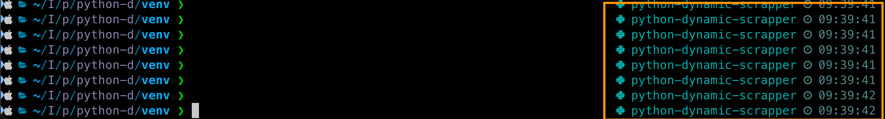

## venv?
venv는 Python에서 제공하는 가상 환경을 생성하기 위한 모듈입니다.  
특정 프로젝트에 필요한 패키지와 의존성을 독립적으로 관리할 수 있도록 도와주며  
이를 통해 시스템 전역의 Python 환경을 변경하지 않고도  
여러 프로젝트를 동시에 관리할 수 있습니다.  
즉 프로젝트 개별로 패키지 관리를 가능하게 해줍니다.

### 1. 가상 환경 생성
```sh
python3 -m venv [가상 환경 디렉터리]
```

- 예제
```sh
python3 -m venv /Users/taehoon/IdeaProjects/python/python-dynamic-scrapper/venv
```

### 2. 가상 환경 활성화
```sh
source [가상 환경 디렉토리]/bin/activate
```

- 예제
```sh
source /Users/taehoon/IdeaProjects/python/python-dynamic-scrapper/venv/bin/activate
```

활성화 되면 터미널에 가상 환경 이름이 표시 됩니다.


### 3. 패키지 설치 
```sh
pip install 패키지
```
가상 환경 활성화 상태에서 패키지 설치 시 해당 환경에만 설치 됩니다.


### 4. 패키지 목록 확인
```
pip list
```

### 5. 가상 환경 비활성화
```sh
deactivate
```


